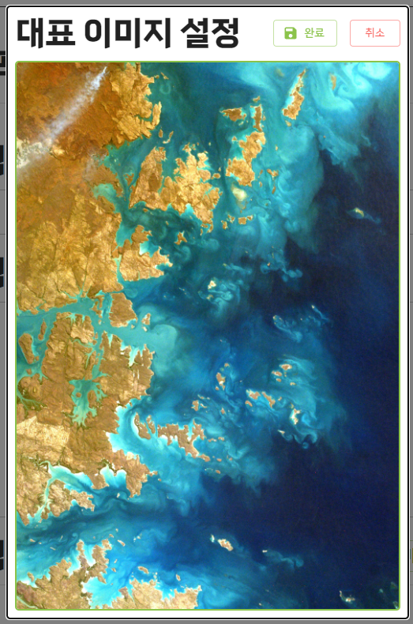
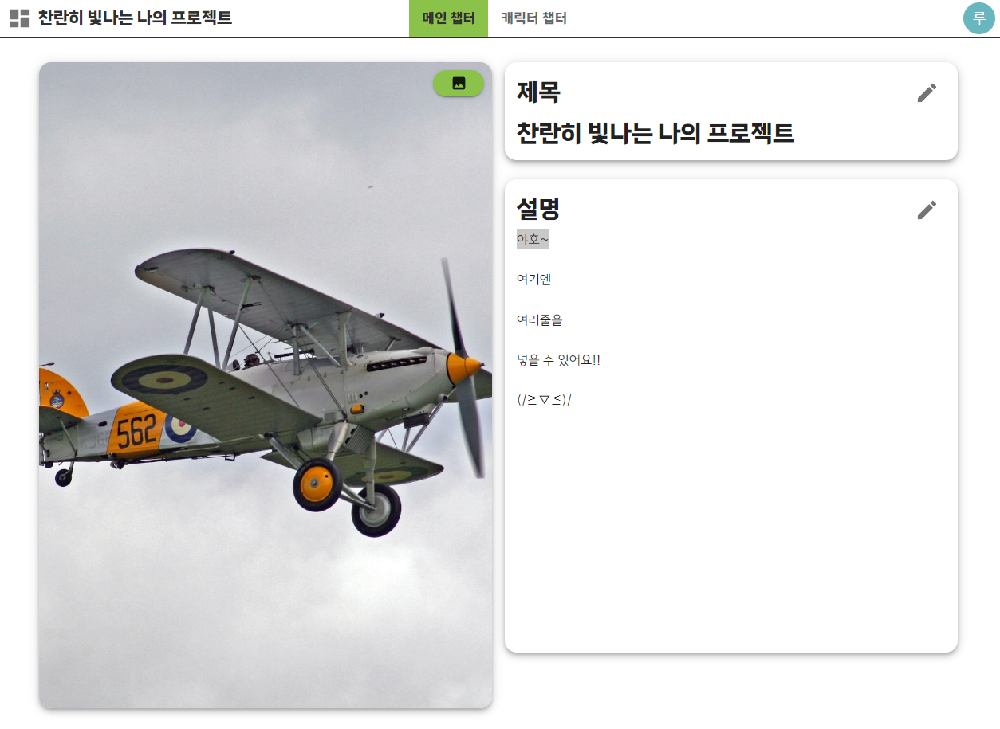

# CreatorsNotebook
### 창작자를 위한 정보관리 웹 서비스를 개발하기 위한 리포지터리입니다.

> # https://www.creators-notebook.com/

# 사용 기술

### Backend

- Java 17
- spring boot 3.0
- spring security
- JWT
- Postgresql
- JPA
  - hypersistence utils

### Frontend

- Javascript
- React
- react redux, react redux toolkit
- react router
- Material UI (MUI)

### Deployment

- frontend 
  - Vercel

 

- backend
  - AWS EC2
  - AWS RDS

## 지원중인 서비스 목록 (현재 버전 : 0.1.15)
### - 캐릭터 관리 서비스

 

# 기능 및 이미지

### 대쉬보드
- 프로젝트 정렬
- 프로젝트 생성
- 프로젝트 삭제 

### 프로젝트 생성

> 이미지 선택시 10:7 비율로 크롭한다.

### 프로젝트 메인 페이지

- 프로젝트 제목 및 설명 수정
- 프로젝트 이미지 수정

### 캐릭터 관리 페이지 (캐릭터 챕터)

- 신규 캐릭터 생성 기능
- 태그 필터 기능
- 캐릭터 정렬 기능
- 상단 영역에서 스크롤시 자동으로 좌우 스크롤 구현

### 캐릭터 모달창

- 단문, 장문, 숫자, 이미지 등 입력 가능
- 속성들의 상하 드래그&드랍 가능
- 이미지는 비율 그대로 올리기 
- 태그 관릭 가능
- 템플릿을 통한 빠른 캐릭터 속성 목록 생성 가능
- 버튼을 통한 모달 상하 이동 가능

### 캐릭터 태그 모달

- 태그 생성, 삭제, 적용 가능. 
- 적용한 태그는 태그 필터에서 사용 가능

### 캐릭터 템플릿 모달

- 모달을 통한 빠른 속성 리스트 적용 가능

### 태그 필터

- 태그 필터 적용 가능 
- 태그 필터 적용 여부
- 선택한 태그를 모두 포함하는 캐릭터만 표시(AND)
- 선택한 태그 중 하나만이라도 포함해도 표시(OR)

### 캐릭터 정렬

- 단문, 숫자 속성에 대해 정렬 가능
- 정렬은 태그를 적용한 상태에서 사용 가능
- 속성은 입력시 업데이트됨
- 내림차순 오름차순 정렬 가능

